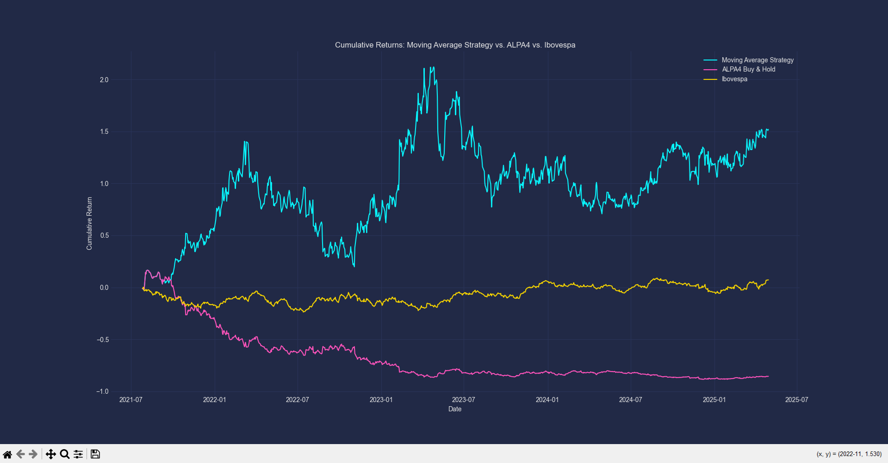

# ALPA4 Moving Average Strategy

This project implements and backtests a moving average crossover trading strategy for the Brazilian stock **ALPA4** (Alpargatas S.A.). The strategy is compared to a simple buy-and-hold approach for ALPA4 and to the performance of the Ibovespa index.

## Strategy Comparison Chart

Below is the chart comparing the cumulative returns of the Moving Average Strategy, ALPA4 Buy & Hold, and the Ibovespa index:



## Project Summary

- **Purpose:** Demonstrate how a technical analysis strategy based on moving averages can outperform or underperform a traditional buy-and-hold investment in stocks.
- **Strategy:** Buy or sell ALPA4 shares depending on the crossover between a short-term (fast) and a long-term (slow) moving average.
- **Comparison:** The cumulative returns of the strategy are visualized against the returns of ALPA4 and the Ibovespa index.

## How It Works

1. **Data Collection:** Historical price data for ALPA4 is downloaded from Yahoo Finance using Python and the `yfinance` library.
2. **Moving Averages:** Calculates two moving averages:
    - Fast moving average (e.g., 7 days)
    - Slow moving average (e.g., 40 days)
3. **Signal Generation:** Generates buy or sell signals:
    - **Buy (1):** When the fast MA is above the slow MA
    - **Sell (-1):** When the fast MA is below the slow MA
4. **Strategy Backtest:** Applies the signals to simulate trading, calculates daily and cumulative returns.
5. **Benchmark Comparison:** Compares the strategy’s performance to simply holding ALPA4 and to investing in the Ibovespa index.
6. **Visualization:** Plots cumulative returns for the strategy, the stock, and the index.
7. **Optimization:** (Optional) You can modify moving average parameters and test different values to improve results.

## Prerequisites

- Python 3.x
- [yfinance](https://pypi.org/project/yfinance/)
- [pandas](https://pandas.pydata.org/)
- [matplotlib](https://matplotlib.org/)
- [numpy](https://numpy.org/)
- [mplcyberpunk](https://github.com/dhaitz/mplcyberpunk) (for plot styling, optional)

Install dependencies:
```bash
pip install yfinance pandas matplotlib numpy mplcyberpunk
```

## Usage

1. Clone the repository.
2. Run the script:
    ```bash
    python alpa4_moving_average_strategy.py
    ```
3. The script will display a plot comparing the cumulative returns of the moving average strategy, ALPA4 buy-and-hold, and the Ibovespa index.

## File Overview

- `alpa4_moving_average_strategy.py`: Main script for the strategy and analysis.
- `README.md`: This documentation.

## Customization & Optimization

You can experiment with different moving average windows by changing the values of `fast_window` and `slow_window` in the script. Try to optimize these parameters for best results.